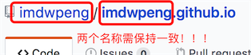

本文利用hexo+github免费搭建属于自己的博客，好记性不如烂笔头，在这里整理一下相关教程。

<!--more-->

## 什么是Hexo
 [Hexo](https://hexo.io/)是一个简单地、轻量地、基于Node的一个静态博客框架，可以方便的生成静态网页托管在github和Heroku上。

## 配置环境
* **Node** : 
    由于 Hexo 是基于 Node ，安装前要先安装 [Node](https://nodejs.org/en/download/)，根据自己系统选择对应的版本安装即可。
* **Hexo** : 
    执行如下命令安装Hexo：(全局安装，MAC系统需在指令前加sudo，然后提示输入本机密码)

```javascript
  npm install -g hexo-cli
```

## 安装博客所需文件
```javascript
  cd /
  hexo init Hexo
  cd /Hexo
  npm install
  hexo generate（可简写为hexo g）
  hexo sever（可简写为hexo s)
```
命令解释:

* cd / 这里返回的根目录取决于你在github客户端的设置，我设置的是F盘，所以返回得也是F盘，所以下面创建的Hexo文件夹也在F盘。

* Hexo 这个文件名可以随便命名，存放的是博客的总目录文件夹。

* cd /Hexo 指向Hexo目录

* npm instal 安装依赖文件

* hexo g 编译

* hexo s 开启本地服务(第5、6步的操作可以合并成hexo s -g)

此时打开浏览器，在地址栏输入http://localhost:4000/
即可查看博客的原型；如果“显示无法访问此网站”也不要沮丧，我这步是直接看到页面的，你无法访问的原因可能你没有翻墙，因为页面中默认使用了ajax.google.com 下的js包。

那么如何翻墙呢？ 下面提供我所知道的两种方法：

这种方法比较简单，下载安装运行Lantern，可以官网下载的吧！这里提供一下安装包吧，链接: http://pan.baidu.com/s/1c2x7eRu
密码: z3kw

这种方法需要修改hosts文件，我的 hosts 文件路径：C:\Windows\System32\drivers\etc ，详细攻略：http://blog.my-eclipse.cn/host-google.html

如果你不想翻墙，可以采用这种方法：
进入你刚新建好的 blog根目录

```javascript
themes/landscape/layout/_partial
```
1，找到 after-footer.ejs把

```javascript
<script src="http://cdn.bootcss.com/jquery/2.1.1/jquery.min.js“ > </script>
```
替换成
```javascript
<script src="http://cdn.bootcss.com/jquery/2.1.1/jquery.min.js“ > </script>
```
2，找到 header.ejs
注释掉或者删掉 下面这句css引用
<link href="//fonts.googleapis.com/css?family=Source+Code+Pro" rel=”stylesheet” type=”text/css”>
hexo server 之后。访问 http://localhost:4000 就会看到blog主页了。

## 部署博客到服务器
也就是把博客部署到github page提供的服务器上

步骤

* **首先退出本地服务，即在终端按ctrl+c即可**
* **创建一个新的repository**

    在自己的Github主页右下角,创建一个新的repository。比如我的Github用户名为imdwpeng，那么我创建的repository的名字应该是 imdwpeng.github.io 。
    
    
    
* **修改Hexo文件夹下_config.yml文件**
    如下图所示修改，repository后的地址要改成你自己的地址：

```javascript
deploy:
    type: git
    repository: http://github.com/usename/usename.github.io.git (改成自己的地址)
    branch: master
```
* 然后在终端输入以下指令：
```javascript
  hexo clean
  hexo g
  hexo d
  hexo s
```
命令解释:
  * hexo clean 清除public，当 source 文件夹中的部分资源更改过之后，特别是对文件进行了删除或者路径的改变之后，需要执行这个命令，然后重新编译。
  * hexo g 编译，一般部署上去的时候都需要编译一下，编译后，会出现一个 public 文件夹，将所有的md文件编译成html文件
  * hexo d 部署博客到github上，如果一切顺利，你就通过访问usename.github.io访问你的博客了！
是的，现在你拥有了自己的博客！
  * hexo s 开启本地服务 (本地测试用，如不需要则忽略本指令)
  
## 新建博文
```javascript
  hexo new 新博文的名字
```
即可在 Hexo\source_posts 目录中找到”新博文的名字.md”这个文件。你就可以使用maekdown编辑器打开进行编写博客内容了。关于markdown语法，可以参考[Markdown简明语法](http://www.appinn.com/markdown/)。

## 文章摘要

在需要显示摘要的地方添加如下代码即可：
```javascript
  以上是摘要
  <!--more-->
  以下是余下全文
```
more以上内容即是文章摘要，在主页显示，more以下内容点击『> Read More』链接打开全文才显示。

##优雅的在博客上插入图片

看到很多博客上说使用七牛，但是这种方法可能是用着最爽的，我们来看一下如何使用：

首先确认 _config.yml 中更改 post_asset_folder:true 。
回到终端，输入
```javascript
  npm install https://github.com/CodeFalling/hexo-asset-image –save
```
继续执行
```javascript
  hexo clean
  hexo g
  hexo d
  hexo s
```
重新创建一个博客名字，然后发现Hexo\source_posts下多了一个与博客名字相同的空文件夹

然后就可以把我们博客中要用到的图片存放在这个文件夹下，需要时直接引用即可，是不是特别方便？

## 安装主题
你可以在[Themes·Hexo](https://github.com/hexojs/hexo/wiki/Themes)上选择你喜欢的主题，我使用的Next主题

### 安装Next主题

参考[Next官方文档](http://theme-next.iissnan.com/getting-started.html),内容十分详尽！

安装主题的方法就是一句git命令：

```javascript
  git clone https://github.com/iissnan/hexo-theme-next themes/next
```
目录是否是next无所谓，只要与_config.yml文件一致即可。

安装完成后，打开hexo_config.yml，修改主题为next

```javascript
  theme: next
```

## 构建新页面

那些小图标都是一个新页面，需要手动创建，那么如何创建？

回到终端
```javascript
  hexo new page “页面名称”
```

比如你要创建一个about页面，就输入hexo new page “about”

正确显示各页面内容

发表博文后发现点击上面建立的页面后发现是空白页，比如，打开标签页面，发现是空白，或者提示找不到！

解决方法：以标签页为例，打开Hexo\source\tags下index.md文件，修改如下：

comments: false即关闭此页面的评论功能

type: “tags”这里的值根据你想更改的页面决定

更改过后，在重新部署到github上，你就可以点击各个页面查看

更多高级功能可以查看[hexo高阶教程next主题优化之加入网易云音乐、网易云跟帖、动态背景、自定义主题、统计功能](http://cherryblog.site/Hexo-high-level-tutorialcloudmusic,bg-customthemes-statistical.html)文章。

<footer>
<hr/>

<p style="textAlign:right;color:#ccc">------------笑对人生，能穿透迷雾；笑对人生，能坚持到底；笑对人生，能化解危机；笑对人生，能照亮黑暗。</p>
</footer>

